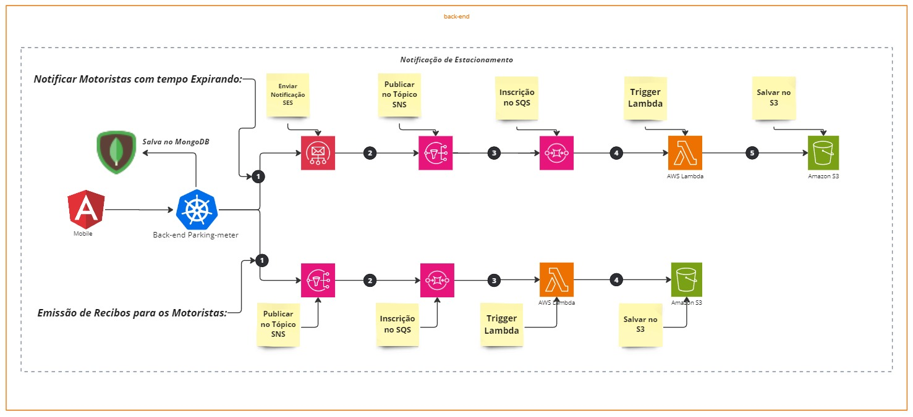

<div align="center">
<a href="https://www.fiap.com.br" target="_blank">
    
</a>

[](https://docs.oracle.com/en/java/javase/11)
[](https://docs.spring.io/spring-boot/docs/current/reference/htmlsingle)
</div>

# TRABALHO DE CONCLUSÃO - FASE 2 - PERSISTINDO DADOS E CONTAINERS

## Desafio:

### 1. Resumo

**1.1. História**

Visão Geral do Sistema:

O novo sistema de parquímetro foi projetado para lidar com a demanda crescente de estacionamento na
cidade. Ele oferece funcionalidades tais, como registro de condutores e veículos, controle de tempo estacionado,
opções flexíveis de pagamento e emissão de recibos.

**1.2. Funcionalidades Principais

1. ### **_Registro de Condutores e Veículos_**

- Os condutores podem se registrar no sistema, associando seus dados pessoais, como nome, endereço e
  informações de contato.
- Um condutor pode vincular vários veículos à sua conta, facilitando o gerenciamento de múltiplos veículos.

2. ### **_Registro de Forma de Pagamento_**

- Antes de usar o sistema, o condutor deve registrar sua forma de pagamento preferida, que pode incluir
  cartão de crédito, débito ou PIX.
- A opção PIX só está disponível para períodos de estacionamento fixos.

3. ### **_Controle de Tempo Estacionado_**

- O sistema permite iniciar o período de estacionamento, oferecendo opções de tempo fixo ou por hora.
- Para períodos fixos, o sistema requer que o condutor indique a duração desejada no momento do registro.
- Para períodos variáveis, o sistema inicia o tempo de estacionamento automaticamente.
- O sistema monitora o tempo com precisão para garantir a cobrança correta.

4. ### **_Alertas de Tempo Estacionado_**

- O sistema inclui um recurso de alerta que notifica o condutor quando o tempo de estacionamento está
  prestes a expirar, no caso de horário fixo.
- Para períodos variáveis, o sistema também emite um alerta informando que o sistema estenderá
  automaticamente o estacionamento por mais uma hora, a menos que o condutor desligue o registro.

5. ### **_Opções de Pagamento_**

- Os condutores têm a opção de pagar pelo estacionamento de várias maneiras, incluindo cartão de crédito,
  débito ou PIX, dependendo da forma de pagamento registrada.
- A cobrança é baseada no tempo utilizado; para tempos fixos, o valor total é cobrado independentemente do
  tempo real utilizado, enquanto para períodos variáveis, a cobrança é por hora completa.
  Pós-Tech Arquitetura e Desenvolvimento JAVA

6. ### **_Emissão de Recibos_**

- O sistema emite recibos automaticamente sempre que o tempo de estacionamento é encerrado e a
  cobrança é realizada.
- Os recibos fornecem informações detalhadas, incluindo o tempo estacionado, a tarifa aplicada e o valor
  total pago.

**1.2. Fluxo de Notificações**

<p align="center">
    
</p>

[Download PDF](docs/notificacao.pdf)

**6.1  **_Notificar Motoristas com Tempo Expirando_**

- Consultar o banco de dados para encontrar estacionamentos que estão prestes a expirar..
- Enviar notificação via SES: Usar o Amazon SES para enviar notificações por e-mail aos motoristas.
- Publica a notificação de com tempo Expirando no tópico SNS: Publicar uma mensagem no tópico SNS para notificar outros sistemas ou serviços.
- Inscrição no SQS: Configurar uma fila SQS para receber mensagens do tópico SNS.
- Trigger a Lambda: Configurar uma função Lambda para ser acionada pelas mensagens na fila SQS.
- Salvar no S3: A função Lambda processa a mensagem e salva os dados no Amazon S3.


**6.2. **_Emissão de Recibos para os Motoristas_**

- Para cada estacionamento expirado, construa a mensagem de recibo.
- Envie a notificação de recibo para os motoristas via SES.
- Publique a mensagem de recibo no tópico SNS. Publicar uma mensagem no tópico SNS para notificar outros sistemas ou serviços.
- Inscrição no SQS: Configurar uma fila SQS para receber mensagens do tópico SNS.
- Trigger a Lambda: Configurar uma função Lambda para ser acionada pelas mensagens na fila SQS.
- Salvar no S3: A função Lambda processa a mensagem e salva os dados no Amazon S3.


7. ### Documentação do com Swagger

Para acesso a documentação dos endpoints da API basta acessar o seguinte
endereço: [Link swagguer](http://localhost:8080/swagger-ui/index.html)
ou

```java
http://seu-servidor:porta/swagger-ui/index.html

```
8. ### **_Utilização do Docker no Projeto_**

- Este projeto utiliza Docker para facilitar a construção e execução da aplicação em um ambiente isolado e consistente. 
- Com Docker, você pode garantir que a aplicação funcione da mesma forma em qualquer lugar, independentemente do ambiente local.

**8.1 Como o Docker é Utilizado
Construção da Aplicação:  

- O Docker usa uma imagem base do Maven para compilar e empacotar a aplicação.

- O código-fonte e o arquivo pom.xml são copiados para dentro do contêiner Docker.

- A aplicação é compilada e empacotada dentro do contêiner, garantindo que todas as dependências sejam resolvidas corretamente.

**8.2 Benefícios:

- **Ambiente Consistente:** O Docker garante que a aplicação seja executada da mesma forma em qualquer lugar, independentemente do ambiente local.
- **Isolamento:** O Docker isola a aplicação de outros processos em execução no sistema operacional, garantindo que não haja conflitos de dependências.
- **Portabilidade:** O Docker permite que a aplicação seja executada em qualquer lugar, independentemente do sistema operacional ou ambiente local.
- **Facilidade de Uso:** O Docker simplifica o processo de construção e execução da aplicação, eliminando a necessidade de configurar manualmente o ambiente de desenvolvimento.

9. ### **_Cobertura de Testes Integrados_**

Os testes de integração cobrem toda a funcionalidade do sistema, garantindo que todos os componentes funcionem corretamente juntos.


### Exemplo de Teste de Integração

```java
@Test
public void testShouldCreateDriver() throws Exception {
    MvcResult result = mockMvc.perform(post("/driver")
    DriverDto driverDto = DriverTemplateDto.driverTemplate();

    MvcResult result = mockMvc.perform(post("/driver")
                    .contentType(MediaType.APPLICATION_JSON)
                    .content(objectMapper.writeValueAsString(driverDto)))
            .andExpect(status().isCreated())
                    .contentType(MediaType.APPLICATION_JSON)
            .andReturn();

                    .content(objectMapper.writeValueAsString(driverDto)))
            .andExpect(status().isCreated())
            .andReturn();

    String driverId = JsonPath.read(result.getResponse().getContentAsString(), "$.id");

    String driverId = JsonPath.read(result.getResponse().getContentAsString(), "$.id");

    assertEquals(1, driverRepository.count());
    assertNotNull(driverId);
}


